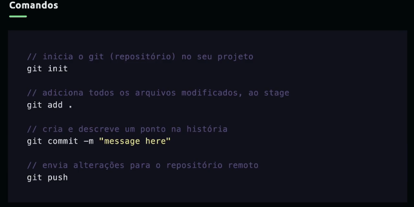

# Git

## Conceitos

### Repository
Local onde ficará o histórico do seu projeto.

### Branch
Linha do tempo.

### Commit
Pontos na história.

### Stage
Preparação do que será enviado para o ponto na história.

git init => inicia o repositório        
git add . => adiciona todos os arquivos modificados
git commit -m "message here" => cria um commit
git push => envia alterações pro repositório