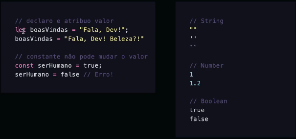
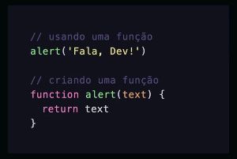
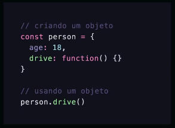

# Introdução ao JavaScript

## Ensinar o Computador

### Algoritmos
Sequência de passos, conjuntos de regras, instruções de TODOS OS PASSOS.

### Lógica de Programação
Maneira de pensar

### Sintaxe
Maneira correta de escrever

### Variáveis
Uma caixinha onde guardamos um tipo de dados para usar mais tarde.

#### Tipos de Dados
Informações que podem ser tem textos, `textos`, `números`, `booleanos` (valores lógicos: verdadeiro ou falso) ou dados mais `estruturados`.



String => "" / '' / ``
Number => 1 / 1.2
Boolean => true / false

let => pode mudar o valor depois
const => imutável, não muda o valor depois

### Funções
- Agrupamento de código
- Reuso de código
- Mini programas dentro do programa maior
- Toda linguagem oferece muitas opções



alert() => função já existente no JavaScript
function + algumaCoisa() => criação de função e utilização de camelCase

### Objetos
Ele domina o JavaScript. Tudo é objeto, ou quase tudo.

*Atributos*
São as propriedades de um objeto.
Exemplo: celular. Celular é um objeto, e possui cor e peso. Isso são atributos, propriedades.

*Métodos*
São as funcionalidades de um objeto.
Exemplo: celular. Celular é um objeto, e possui funcionalidades, como enviar SMS, conectar na Internet.



```
const celular = {
    cor: "preto",
    ligar: function() {
        alert("Ligando!")
    }
}

celular.cor

celular.ligar()
```